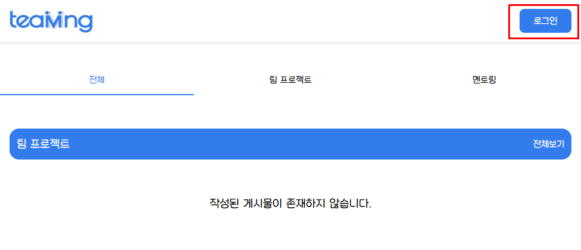
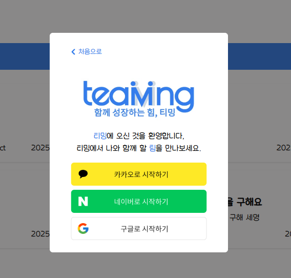
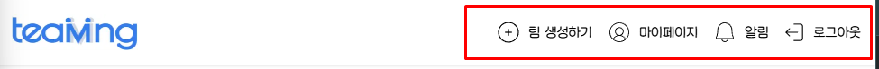
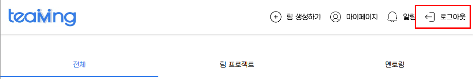

## 1. 로그인 개요
사용자는 카카오, 구글, 네이버 계정을 이용해 로그인을 진행합니다.   
로그인 후 JWT 토큰이 발급되며, 이후 요청 시 해당 토큰을 사용하여 인증을 진행합니다.

### 1.1. 주요 요구사항
- 카카오, 구글, 네이버 OAuth를 연동합니다. 
- 최초 로그인 시 자동으로 회원가입이 진행됩니다. 
- JWT 토큰을 사용하여 인증을 유지합니다. 
- 로그인 상태는 클라이언트(브라우저)에서 쿠키 또는 로컬 스토리지를 활용하여 관리합니다. 
- JWT 토큰 만료 시 자동 로그아웃을 처리합니다.

 

## 2. 로그인 프로세스
### 2.1. 로그인 페이지 접근

- 사용자는 헤더(네비게이션) 우측 로그인 버튼을 클릭하여 로그인 페이지에 접근합니다
- 로그인되지 않은 사용자가 로그인 시도를 하면, 자동으로 회원가입 절차가 진행됩니다.

 

- 로그인 페이지에 접근하면 소셜 로그인 제공자(카카오, 네이버, 구글) 중 하나를 선택할 수 있습니다.
- 사용자는 원하는 로그인 방식을 선택하여 로그인 및 회원가입을 진행할 수 있습니다.
- 선택한 로그인 방식에 따라 OAuth 인증이 진행되며, 이후 JWT 토큰이 발급됩니다.

 

### 2.2. 회원 정보 입력
- 최초 로그인 시 회원 정보 입력 페이지로 이동합니다.
- 사용자는 아래 필수 정보를 입력해야 합니다.

| 필드명   | 타입     | 설명                   | 비고               |
|-------|--------|----------------------|------------------|
| 닉네임   | string | 사용자가 설정하는 닉네임        | 최소 2자 이상, 최대 20자 |
| 소개    | string | 사용자의 자기소개 내용         | 최대 200자          |
| 기술 스택 | number | 사용자가 선택한 기술 스택의 ID 값 | 최소 1개 이상 선택      |

#### 2.2.1. 닉네임 (name)
- 사용자가 로그인 후 설정하는 닉네임입니다. 
- 최소 2자 이상, 최대 20자까지 입력 가능하며, 중복 검사가 필요할 수 있습니다. 
- 공백만 입력할 수 없으며, 특수 문자 제한 여부는 정책에 따라 결정됩니다.

#### 2.2.2. 소개 (introduce)
- 사용자가 자신의 정보를 간략하게 소개하는 필드입니다. 
- 최대 200자까지 입력 가능하며, 줄 바꿈(\n)을 허용합니다.

#### 2.2.3. 기술 스택 (stacks)
- 사용자가 선택한 기술 스택을 식별하는 숫자 값 (ID 또는 코드)입니다.

#### 2.2.4. 예외 처리
- 필수 입력란이 비어 있을 경우 `가입 완료` 버튼이 비활성화됩니다.

 

### 2.3. 로그인 후 사용자 환경
- 로그인 성공 시, 서버에서 JWT 토큰을 발급하고 클라이언트에 저장합니다. 
- `로컬 스토리지` & `쿠키(httpOnly, Secure)` 를 사용하여 저장합니다. 
- 로그인한 사용자는 헤더(네비게이션)에서 프로필 정보와 로그아웃 버튼을 확인할 수 있습니다.

#### 2.3.1. 로그인 후 페이지 이동
- 로그인 후 사용자는메인 페이지로 리디렉션됩니다. 
- 만약 최초 로그인 이라면, 추가 정보를 입력하는 페이지로 이동합니다.

#### 2.3.2. 헤더 구성요소

| 필드명          | 설명                        |
|--------------|---------------------------|
| 로고 (Teaming) | 메인 페이지로 이동                |
| 팀 생성하기       | 새로운 팀 프로젝트를 생성            |
| 알림           | 프로젝트 업데이트 등의 알림 확인        |
| 로그아웃         | 현재 로그인 세션을 종료하고 JWT 토큰 삭제 |

#### 2.3.3. 로그인 상태 유지
- 사용자는 로그인 상태를 유지할 수 있으며, 다음과 같은 방식으로 관리됩니다. 
- 자동 로그인 : 브라우저 쿠키 또는 로컬 스토리지에 저장된 JWT 토큰을 활용 
- 세션 만료 처리 : JWT 토큰이 만료되면 자동 로그아웃 후 로그인 페이지로 이동 
- 사용자가 직접 로그아웃할 경우 : 저장된 JWT 토큰을 삭제하고 로그인 페이지로 이동

 

### 2.4. 로그아웃

- 로그인한 사용자는 헤더(네비게이션) 우측 `로그아웃` 버튼을 클릭하여 로그아웃을 진행합니다.
- 로그아웃 시 JWT 토큰이 삭제되며, 메인 페이지로 이동합니다

 

## 3. 예외처리
- 사용자가 로그인을 취소한 경우 → 로그인 화면으로 다시 이동 
- OAuth 제공자 오류 발생 시 → 오류 메시지 출력 및 재시도 안내 
- JWT 토큰 만료 → 자동 로그아웃 후 로그인 페이지로 리디렉션