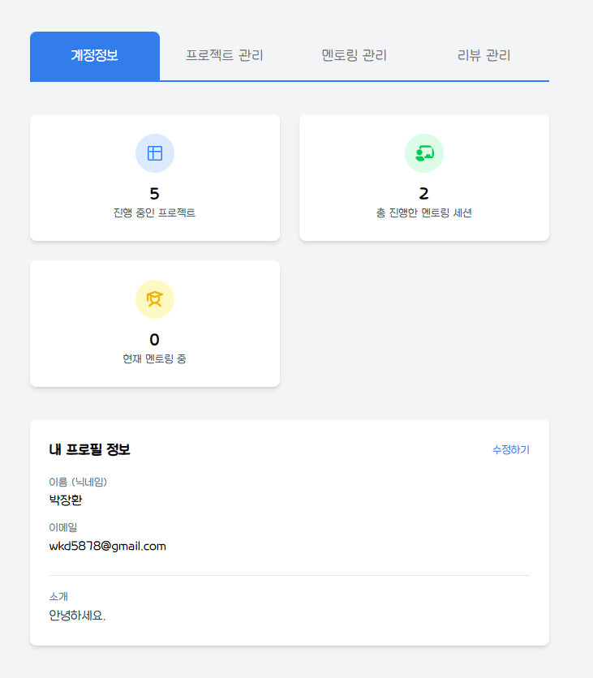
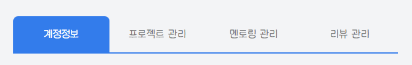
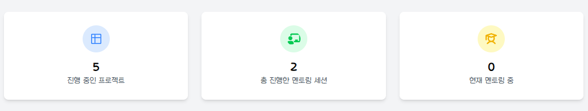
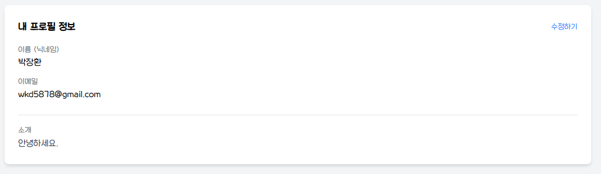
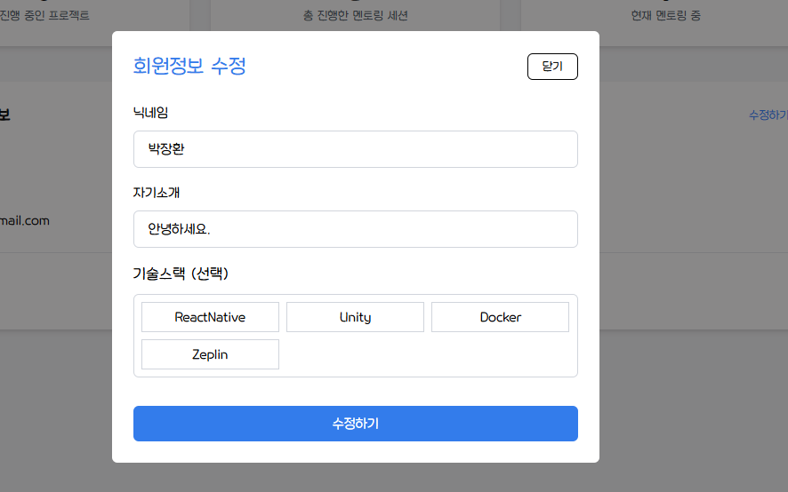

## 1. 사용자 정보 관리
사용자는 회원 정보를 조회하고, 수정 및 추가 정보를 입력할 수 있습니다.   
또한, 사용자는 자신의 리뷰 및 멘토링 팀 정보를 확인할 수 있으며, 유저 페이지와 마이페이지에서 회원 정보를 조회할 수 있습니다.

### 1.1 요구사항
- 사용자 정보는 닉네임, 소개, 기술 스택을 포함합니다. ]
- 사용자는 본인의 회원 정보를 조회 및 수정할 수 있습니다. 
- 사용자는 추가 정보를 입력할 수 있습니다. 
- 사용자는 본인의 리뷰 및 멘토링 팀 정보를 조회할 수 있습니다. 
- 로그인된 사용자의 리뷰 및 경고 횟수를 조회할 수 있습니다.

## 2. 계정 정보
### 2.1. API
| 메서드 | 경로     | 설명                 |
|-----|--------|--------------------|
| GET | /users | 로그인된 사용자의 회원 정보 조회 |
사용자는 본인의 회원 정보를 조회할 수 있습니다.   
마이페이지에서 사용되며, Access Token이 필요합니다.

#### 2.1.1. 요청 헤더
```text
Authorization: Bearer {AccessToken}
```
`GET /users`요청 시, 로그인된 사용자의 정보를 반환합니다.

#### 2.1.2. 응답 예시
```json
{
  "status": 0,
  "code": "SUCCESS",
  "message": "요청이 성공적으로 처리되었습니다.",
  "data": {
    "id": 123,
    "email": "user@example.com",
    "name": "John Doe",
    "provider": "google",
    "portfolio": "https://portfolio.example.com",
    "warningCnt": 2,
    "introduce": "프론트엔드 개발자로 일하고 있습니다.",
    "stacks": ["React", "TypeScript", "Next.js"]
  }
}
```

<br/>

### 2.2. 사용자 정보
사용자 정보 대시보드는 현재 진행 중인 프로젝트, 멘토링 상태, 기본 프로필 정보를 표시합니다.



<br/>

#### 2.1.1. 페이지 접근


로그인한 사용자는 상단 네비게이션을 통해 **마이페이지(My Page)** 에 접근할 수 있습니다.
마이페이지에서는 회원 정보 조회, 프로젝트 관리, 멘토링 관리, 리뷰 관리 기능을 사용할 수 있습니다.

<br/>

#### 2.1.2. 탭 네비게이션


<br/>

#### 2.1.3. 통계 정보


대시보드에서는 사용자의 프로젝트 및 멘토링 진행 상태를 확인할 수 있습니다.

| 항목           | 설명                    |
|--------------|-----------------------|
| 진행 중인 프로젝트   | 사용자가 현재 참여 중인 프로젝트 개수 |
| 총 진행한 멘토링 세션 | 사용자가 참여했던 멘토링 세션 개수   |
| 현재 멘토링 중     | 사용자가 현재 진행 중인 멘토링 개수  |

<br/>

#### 2.1.4. 사용자 프로필


내 프로필 정보에는 이메일, 이름(닉네임), 경고 횟수, 소개, 기술 스택이 표시됩니다.   
사용자는 수정하기 버튼을 눌러 프로필 정보를 업데이트할 수 있습니다.

| 필드명      | 타입     | 필수 여부 | 설명                           |
|-------------|----------|-----------|--------------------------------|
| email       | string   | ✅         | 사용자의 이메일 주소            |
| name        | string   | ✅         | 사용자의 닉네임 (최소 2자, 최대 20자) |
| warningCnt  | number   | ✅         | 사용자의 누적 경고 횟수         |
| introduce   | string   | ❌         | 사용자의 자기소개 (최대 200자)  |
| stacks      | string[] | ❌         | 사용자의 기술 스택 리스트       |


<br/>

### 2.3. 사용자 정보 수정


<br/>

## 3. 프로젝트 관리
### 3.1. API
| 메서드 | 경로             | 설명                 |
|-----|----------------|--------------------|
| GET | /users/project | 로그인한 사용자의 멘토링 팀 조회 |
사용자는 본인이 참여한 프로젝트 목록을 조회할 수 있습니다.

#### 3.1.1. 요청 헤더
```text
Authorization: Bearer {AccessToken}
```

#### 3.1.2. 응답 예시
```json
{
  "status": 0,
  "code": "string",
  "message": "string",
  "data": [
    {
      "teamName": "string",
      "startDate": "string",
      "endDate": "string",
      "status": "RECRUITING",
      "role": "OWNER",
      "projectTeamId": 0,
      "createdDate": "string"
    }
  ]
}
```

<br/>

## 4. 멘토링 관리
### 4.1. API
| 메서드 | 경로                          | 설명                           |
|--------|-------------------------------|--------------------------------|
| GET    | /users/mentoring/teams         | 로그인한 사용자의 멘토링 팀 조회 |
사용자는 특정 사용자 및 본인의 멘토링 팀 정보를 조회할 수 있습니다.

#### 4.1.1. 요청 헤더
```text
Authorization: Bearer {AccessToken}
```

#### 4.1.2. 응답 예시
```json
{
  "status": 0,
  "code": "string",
  "message": "string",
  "data": [
    {
      "teamName": "string",
      "startDate": "2025-03-10",
      "endDate": "2025-03-10",
      "status": "RECRUITING",
      "role": "LEADER",
      "id": 0,
      "createdDate": "string"
    }
  ]
}
```

<br/>

## 5. 리뷰 관리
### 5.1. API
| 메서드 | 경로                  | 설명                        |
|--------|-----------------------|-----------------------------|
| GET    | /users/reviews         | 로그인한 사용자의 리뷰 조회  |
사용자는 특정 사용자 및 본인의 리뷰를 조회할 수 있습니다.

#### 2.1.1. 요청 헤더
```text
Authorization: Bearer {AccessToken}
```

#### 5.1.2. 응답 예시
```json
{
  "status": 0,
  "code": "string",
  "message": "string",
  "data": [
    {
      "teamId": 0,
      "revieweeId": 0,
      "rating": 0,
      "content": "string"
    }
  ]
}
```

<br/>

## 6. 예외 처리
| 오류 코드 | 설명                              |
|-----------|-----------------------------------|
| 400       | 잘못된 요청 (입력값 검증 실패 등)  |
| 401       | 인증 실패 (Access Token이 없거나 만료됨) |
| 403       | 접근 권한 없음 (다른 사용자의 정보 수정 시) |
| 404       | 요청한 정보를 찾을 수 없음         |
| 500       | 내부 서버 오류                    |